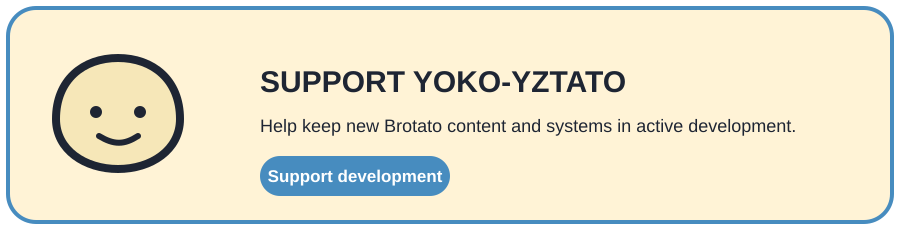

<div align="center">
  <h1>Yoko-YzTato</h1>
  <p><strong>A content-heavy Brotato expansion built from structured resources and focused runtime systems.</strong></p>
  <p>Characters · Weapons · Items · Enemies · Worlds · Gameplay systems</p>
  <p>
    <a href="https://github.com/CYoJkoY/Yoko-YzTato/releases"></a>
    <a href="https://github.com/CYoJkoY/Yoko-YzTato/actions/workflows/release.yml"></a>
    
    
    <a href="LICENSE"></a>
  </p>
  <p><a href="#what-it-is">Overview</a> · <a href="#content">Content</a> · <a href="#runtime-model">Runtime</a> · <a href="#installation">Install</a> · <a href="#development--support">Development</a></p>
</div>

> **Core boundary:** resources describe content, `Yoko-NewContentLoader` owns shared registration, and `extensions/` handles behavior that requires deeper Brotato integration.

##  What it is

Yoko-YzTato is the content-heavy expansion layer of the Yoko Brotato mod stack. It combines a large resource catalog with narrow runtime extensions rather than turning every new mechanic into bespoke registration code.

```text
content data → NewContentDataDLC1.tres → Yoko-NewContentLoader → Brotato services
                                      ↘ extensions/ ↗
```

##  Content

| Category | Location |
| :--- | :--- |
| Characters | `content/characters/` |
| Weapons | `content/weapons/` |
| Items | `content/items/` |
| Enemies / entities | `content/entities/` |
| Challenges | `content/challenges/` |
| Maps / backgrounds | `content/maps/` |
| Projectiles | `content/projectiles/` |
| Particles | `content/particles/` |
| Sets | `content/sets/` |
| Structures | `content/structures/` |
| Zones | `content/zones/` |
| Scenes | `content/scenes/` |
| Localization | `translations/` |

`NewContentDataDLC1.tres` is the aggregate DLC resource consumed by the loader.

##  Runtime model

Runtime extensions remain organized around the system that owns the behavior.

| Area | Examples |
| :--- | :--- |
| Combat | Weapon behavior, projectiles, hit effects, custom effects |
| Entities | Enemy behavior, targeting, spawning, special entities |
| Run / player | Player and run-state integration |
| Waves | Wave logic and spawning |
| Shop / upgrades | Shop hooks and item/weapon services |
| Content services | Lookups and shared support |

`mod_main.gd` is the runtime entry point.

##  Installation

Requirements: **Brotato 1.1.15.4**, **Brotato Mod Loader 6.3.0**, and [Yoko-NewContentLoader](https://github.com/CYoJkoY/Yoko-NewContentLoader).

1. Install the required game and loader versions.
2. Install the matching NewContentLoader release.
3. Download the latest `YzTato-*.zip` from [Releases](https://github.com/CYoJkoY/Yoko-YzTato/releases).
4. Place the ZIP in the Mod Loader `mods` directory.
5. Launch Brotato and verify the dependency chain loads.

For development, the intended unpacked layout is:

```text
mods-unpacked/
├── Yoko-NewContentLoader/
└── Yoko-YzTato/
```

##  Development & support

For new content, separate resource data, runtime hooks, registration, and localization. Changes to shared runtime behavior should be tested with the complete dependency stack.

`manifest.json` is authoritative for version `1.1.0`, dependencies, and the declared Brotato / Mod Loader compatibility.

<a href="https://cyojkoy.github.io/Payment/"></a>

Development support: **https://cyojkoy.github.io/Payment/**

## License

Yoko-YzTato is licensed under the [MIT License](LICENSE).

<div align="center"><sub>Yoko-YzTato · Brotato content expansion by Yoko.</sub></div>
